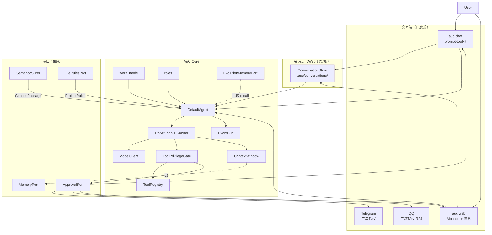
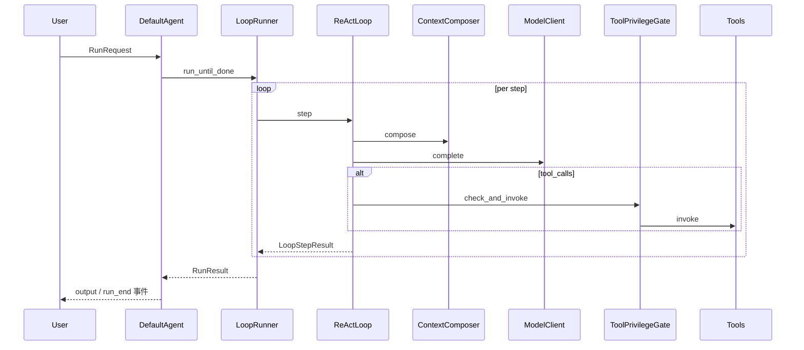

# AuC 架构总览（现状 As-Is）

> 版本：v1.1 · 2026-06　|　本文描述**当前已实现**的架构。目标演进（R1–R23）见 [架构设计.md](架构设计.md)。

AuC（**Agents-ufy-Core**）是 ufy 智能体体系中的**单智能体核心框架**：用 Python 与 asyncio 实现可终止的「推理—行动」循环，不内置多智能体编排。AuM（Meta）可在 AuC 定义的端口之上提供记忆、**上下文切片**、**项目军规**与 **L3 二次授权** 网关；AuC 亦可独立运行（`memory=None`）并自带 Web/CLI 双端与进化记忆。

设计哲学吸收 Claude Code 的 **Context Control** 与 **Human-in-the-loop**，详见 [design-philosophy.md](design-philosophy.md)。

## 设计原则

1. **最小核心** — AuC 只保证一个 Agent 能完成一轮可终止的推理—行动循环；不内置 RAG、向量检索。
2. **端口隔离** — 通过 `MemoryPort`、`ContextComposer` 将「记什么、怎么检索」交给 AuM 或可选实现（如 `EvolutionMemoryPort`）；AuC 仅持有当前 Run 的 `ContextWindow`（短期工作区）。
3. **上下文克制** — 代码上下文以 `ContextPackage`（AuM Slicer 或内置 `SemanticSlicer`）为主，禁止裸读整仓（[context-slicer.md](context-slicer.md)）。
4. **军规前置** — Run 前注入 `.aurules` / `FileRulesPort` 解析结果（[aurules.md](aurules.md)）。
5. **高危 Human-in-the-loop** — L3 工具挂起 Run，经 `ApprovalPort` 二次授权（CLI / Web / Telegram / **QQ**，[tool-privilege.md](tool-privilege.md)）。
6. **可观测** — `EventBus` 与结构化 `RunEvent`（含 `approval_required` 等），便于日志、调试与 IM。
7. **可测试** — Loop、Tool、`ModelClient` 均面向接口；提供 `InMemoryModelClient` 等测试替身。
8. **类型优先** — 接口以 `typing.Protocol` 与 `@dataclass` 描述。

## 系统上下文



| 组件 | 职责 |
|------|------|
| **DefaultAgent** | 对外入口：`run` / `run_stream` / `cancel` |
| **ReActLoop** | 默认可插拔推理策略 |
| **AgentLoopRunner** | 驱动 Loop 直至终止条件 |
| **ModelClient** | LLM 适配（OpenAI / Anthropic / DeepSeek） |
| **ToolRegistry** | 工具注册与 schema 暴露 |
| **ToolPrivilegeGate** | L1/L2/L3 分级与 L3 挂起 |
| **ContextWindow** | 当前 Run 的消息工作区（`ListContextWindow`） |
| **EventBus** | Run 生命周期事件分发 |
| **work_mode** | 8 种工作模式 + 自动识别 |
| **roles** | 5 种内置角色 persona；`metadata.role_id` 覆盖系统提示；`agent_id=chat:{role}` |
| **EvolutionMemoryPort** | `.auc/evolution.yaml` 跨会话经验召回；**按 `role:{id}` 标签分片**（遗留无标签条目全局可见） |
| **ConversationStore** | Web 会话持久化（目标：CLI/Web 共享，见 R7） |
| **MemoryPort**（端口） | AuM 或 `EvolutionMemoryPort` 实现 |
| **ContextPackage** | 任务相关代码片段包 |
| **ProjectRulesPort** | 军规注入（`FileRulesPort`） |
| **ApprovalPort** | L3 人工批复（`ConsoleApprovalPort` / `WebApprovalPort` / `TelegramApprovalPort` / `QQApprovalPort`） |

多智能体编排不在 AuC 范围内；Specialist 遥控基础见 `integration/dispatcher.py`（`MetaDispatcher`）。

## 当前包结构

```
auc/
├── agent.py              # DefaultAgent, AgentConfig
├── chat_agent.py         # CLI/Web 对话 Agent 组装
├── cli.py / cli_ui.py    # auc chat 与子命令
├── config.py             # settings.json 加载
├── work_mode.py          # 8 种工作模式
├── roles/                # 推荐角色目录（每角色子文件夹，R25）
│   ├── coder/            # role.yaml + prompt.md + evolution.yaml
│   └── ...
├── multimodal.py         # 图片输入
├── sandbox.py            # 沙盒路径校验
├── messages.py / types.py
├── loop/
│   ├── base.py           # AgentLoop, LoopContext, LoopResult
│   └── react.py          # ReActLoop
├── model/                # OpenAI / Anthropic / DeepSeek 适配
├── tools/
│   ├── files.py          # read/write/delete/list_dir
│   ├── fetch.py          # fetch_url (L3)
│   └── registry.py
├── context/
│   └── window.py         # ListContextWindow, TruncatePolicy
├── ports/                # memory, rules, package, approval
├── policy/
│   └── privilege.py      # ToolPrivilegeGate
├── events/
│   └── bus.py
├── integration/
│   ├── evolution.py      # EvolutionMemoryPort, save_lesson
│   ├── slicer.py         # SemanticSlicer
│   ├── im_card.py        # IM 审批卡片（TG/QQ 共用）
│   ├── im_base.py        # HttpImApprovalPort 基类
│   ├── telegram.py       # Telegram 二次授权
│   ├── qq.py             # QQ 二次授权（R24）
│   └── aum.py            # AuM 挂载辅助
└── web/
    ├── server.py         # FastAPI + SSE
    ├── conversations.py  # ConversationStore（R7 目标上移至 auc/）
    ├── session.py / runner.py / approval.py
    └── static/           # 前端 SPA
```

依赖与安装见 [README](../README.md)；模型配置见 [model-config.md](model-config.md)。

## 当前工具面

| 工具 | 级别 | 说明 |
|------|------|------|
| `read_file` / `list_dir` | L1 | 沙盒内 |
| `write_file` / `delete_file` | L2 | 沙盒内 |
| `fetch_url` | L3 | SSRF 防护，需授权 |
| `save_lesson` / `promote_nugget` | L1/L2 | 进化记忆 |
| `echo` | L1 | 测试用 |

> **缺口**（见 [需求.md](需求.md)）：无 `run_command`、无 `grep_search`/`glob_files`、无生产级上下文压缩（`summarize` 策略未实现）、无检查点回滚、无 plan 工作模式、无会话级自治级别。

## 一次 Run 的数据流



### 阶段说明

| 阶段 | 行为 |
|------|------|
| **初始化** | 生成 `run_id`；加载 `ProjectRules`；挂载 `ContextPackage`（若有）；工作模式注入；用户输入写入 `ContextWindow`；可选 `memory.recall` |
| **每步（step）** | `compose` → `ModelClient.complete` → `ToolPrivilegeGate.check_and_invoke`（L3 可能挂起）→ 追加消息到 window |
| **记忆写回** | 若挂载 `MemoryPort`，按策略 `remember` |
| **终止** | 见下文「终止条件」 |
| **收尾** | 组装 `RunResult`；发出 `run_end`；Web 侧 `ConversationStore.persist()` |

更细的 ReAct 状态机见 [loops.md](loops.md)。接口定义见 [interfaces.md](interfaces.md)。

## 上下文与压缩（现状）

`TruncatePolicy` 支持 `drop_oldest`、`drop_middle`；`summarize` 已在 `types.py` 枚举中声明，**尚未实现**（`ListContextWindow.truncate` 对 `summarize` 回退为截尾）。生产级 auto-compaction 规划见 [详细设计.md](详细设计.md) §3（`SummarizingCompactor`）。

## 终止条件

| 条件 | `RunResult.status` |
|------|-------------------|
| 模型返回无 `tool_calls` 且产生最终文本 | `completed` |
| 达到 `max_steps` | `max_steps` |
| 用户调用 `agent.cancel(run_id)` | `cancelled` |
| L3 审批超时或用户拒绝 | `cancelled` 或 `denied` |
| 等待 L3 批复中 | `pending_approval` |
| 不可恢复错误 | `error` |

## 与 AuM 的边界（摘要）

| 责任 | AuC（现状） | AuM |
|------|------------|-----|
| 单轮推理循环 | 是 | 否 |
| 工具注册与执行 | 是 | 可选包装 |
| 工具 L1/L2/L3 门控 | 是 | IM 批复 L3 |
| 跨 Run 记忆 | 端口 + `EvolutionMemoryPort`（内置可选） | `MemoryPort` 完整实现 |
| 代码上下文切片 | `SemanticSlicer`（内置）+ `ContextPackage` 类型 | `SemanticSlicer` 增强版 |
| 项目军规 | `FileRulesPort` | Rules Matrix |
| 上下文压缩 | `TruncatePolicy`（基础策略） | 可替换智能实现 |
| Web 会话持久化 | `ConversationStore`（Web 包内） | 可集中式 `SessionStore` |
| CLI 会话恢复 | 未实现（R7） | — |

`memory=None` 且无 Slicer/Rules 时，AuC 退化为轻量对话 Agent。详情见 [aum-integration.md](aum-integration.md)。

## 演进文档

| 文档 | 内容 |
|------|------|
| [需求.md](需求.md) | 差距分析与 R1–R23 需求清单 |
| [架构设计.md](架构设计.md) | 目标架构（To-Be） |
| [方案设计.md](方案设计.md) | 技术选型与决策 |
| [详细设计.md](详细设计.md) | 接口、数据格式与测试计划 |

## 相关文档

- [design-philosophy.md](design-philosophy.md) — Claude Code 经验与生态蓝图
- [context-slicer.md](context-slicer.md) — Au-Context Slicer
- [aurules.md](aurules.md) — 项目军规
- [tool-privilege.md](tool-privilege.md) — L3 二次授权
- [interfaces.md](interfaces.md) — Protocol 与数据类
- [loops.md](loops.md) — 可插拔 Loop 与 ReAct
- [aum-integration.md](aum-integration.md) — AuM 挂载与扩展点
- [glossary.md](glossary.md) — 术语表
- [adr/001-async-pluggable-loop.md](adr/001-async-pluggable-loop.md) … [adr/005-tool-privilege-2fa.md](adr/005-tool-privilege-2fa.md)
- [adr/006-tool-decision-chain.md](adr/006-tool-decision-chain.md) — 工具裁决链（目标）
