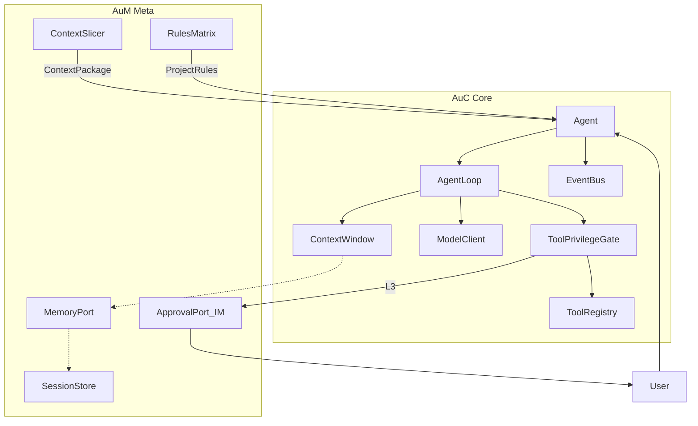
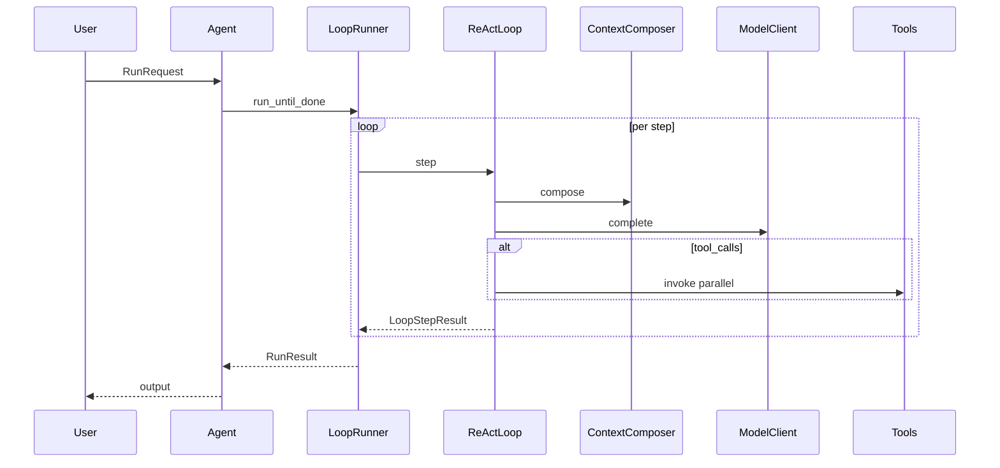

# AuC 架构总览

AuC（**Agents-ufy-Core**）是 ufy 智能体体系中的**单智能体核心框架**：用 Python 与 asyncio 实现可终止的「推理—行动」循环，不内置长期记忆与多智能体编排。AuM（Meta）在 AuC 定义的端口之上提供记忆、**上下文切片**、**项目军规**与 **L3 二次授权** 网关。

设计哲学吸收 Claude Code 的 **Context Control** 与 **Human-in-the-loop**，详见 [design-philosophy.md](design-philosophy.md)。

## 设计原则

1. **最小核心** — AuC 只保证一个 Agent 能完成一轮可终止的推理—行动循环；不内置 RAG、向量检索或跨会话记忆。
2. **端口隔离** — 通过 `MemoryPort`、`ContextComposer` 将「记什么、怎么检索」交给 AuM；AuC 仅持有当前 Run 的 `ContextWindow`（短期工作区）。
3. **上下文克制** — Specialist 不裸读整仓；代码上下文以 AuM 交付的 `ContextPackage` 为主（[context-slicer.md](context-slicer.md)）。
4. **军规前置** — Run 前强制注入 `.aurules` / `AUM.md` 解析结果（[aurules.md](aurules.md)）。
5. **高危 Human-in-the-loop** — L3 工具挂起 Run，经 AuM IM 网关二次授权（[tool-privilege.md](tool-privilege.md)）。
6. **可观测** — `EventBus` 与结构化 `RunEvent`（含 `approval_required` 等），便于日志、调试与 IM。
7. **可测试** — Loop、Tool、`ModelClient` 均面向接口；实现阶段提供测试替身。
8. **类型优先** — 接口以 `typing.Protocol` 与 `@dataclass` 描述，为后续 `py.typed` 包铺路。

## 系统上下文



| 组件 | 职责 |
|------|------|
| **Agent** | 对外入口：`run` / `run_stream` / `cancel` |
| **AgentLoop** | 可插拔推理策略（默认 `ReActLoop`） |
| **AgentLoopRunner** | 驱动 Loop 直至终止条件 |
| **ModelClient** | LLM 适配（不绑定单一厂商） |
| **ToolRegistry** | 工具注册与 schema 暴露 |
| **ToolPrivilegeGate** | L1/L2/L3 分级与 L3 挂起 |
| **ContextWindow** | 当前 Run 的消息工作区 |
| **EventBus** | Run 生命周期事件分发 |
| **MemoryPort**（端口） | 由 AuM 实现；AuC 仅调用 |
| **ContextPackage** | 任务相关代码片段包（AuM Slicer 产出） |
| **ProjectRulesPort** | 军规注入（AuM 解析 `.aurules`） |
| **ApprovalPort** | L3 人工批复（AuM IM 网关） |

多智能体编排不在 AuC 范围内；若未来需要，可另立独立仓库（例如 AuO）。Specialist 由 AuM 分派，见 [design-philosophy.md](design-philosophy.md)。

## 建议包结构

实现阶段采用如下布局（当前仓库仅文档，尚未创建源码目录）：

```
auc/
├── agent.py          # Agent, AgentConfig, Agent.run()
├── loop/
│   ├── base.py       # AgentLoop Protocol, LoopContext, LoopResult
│   └── react.py      # ReActLoop（默认）
├── model/
│   └── client.py     # ModelClient, ChatMessage, StreamChunk
├── tools/
│   ├── base.py       # Tool, ToolResult, ToolSchema
│   └── registry.py   # ToolRegistry
├── context/
│   └── window.py     # ContextWindow（短期）
├── ports/
│   ├── memory.py     # MemoryPort, ContextComposer
│   ├── rules.py      # ProjectRulesPort
│   ├── package.py    # ContextPackage
│   └── approval.py   # ApprovalPort
├── policy/
│   └── privilege.py  # ToolPrivilegeGate, ToolPolicy
├── events/
│   └── bus.py        # EventBus, RunEvent
└── types.py          # RunId, AgentId, 公共枚举
```

依赖管理（`pyproject.toml`）、CI 与示例 CLI 见 [README](../README.md) 实现路线图。

## 一次 Run 的数据流

用户通过 `RunRequest` 发起一次运行；Agent 构造 `LoopContext` 并交给 `AgentLoopRunner`。



### 阶段说明

| 阶段 | 行为 |
|------|------|
| **初始化** | 生成 `run_id`；加载 `ProjectRules` 注入 RulesBlock；挂载 `ContextPackage`（若有）；用户输入写入 `ContextWindow`；可选 `memory.recall` |
| **每步（step）** | Loop 调用 `compose`（含 Rules + Package + recall + window）→ `ModelClient.complete` → `ToolPrivilegeGate` 校验 → 若有 `tool_calls` 则 invoke（L3 可能挂起待批复）→ 追加消息到 window |
| **记忆写回** | 若挂载 `MemoryPort`，每步结束可 `remember` 选定消息（策略由 AuM 或配置决定） |
| **终止** | 见下文「终止条件」 |
| **收尾** | 组装 `RunResult`（`output`、`messages`、`status`）；发出 `run_end` 事件 |

更细的 ReAct 状态机见 [loops.md](loops.md)。接口定义见 [interfaces.md](interfaces.md)。

## 终止条件

统一由 `LoopConfig` 与 `AgentLoop.should_continue` 判定：

| 条件 | `RunResult.status` |
|------|-------------------|
| 模型返回无 `tool_calls` 且产生最终文本 | `completed` |
| 达到 `max_steps` | `max_steps` |
| 用户调用 `agent.cancel(run_id)` | `cancelled` |
| L3 审批超时或用户拒绝 | `cancelled` 或 `denied` |
| 等待 L3 批复中 | `pending_approval` |
| 不可恢复错误（模型、工具、配置） | `error` |

## 与 AuM 的边界（摘要）

| 责任 | AuC | AuM |
|------|-----|-----|
| 单轮推理循环 | 是 | 否 |
| 工具注册与执行 | 是 | 可选包装 |
| 工具 L1/L2/L3 门控 | 是 | IM 批复 L3 |
| 跨 Run / 长期记忆 | 端口定义 | 实现 `MemoryPort` |
| 代码上下文切片 | `ContextPackage` 类型 | `SemanticSlicer` |
| 项目军规 | `ProjectRulesPort` | Rules Matrix 解析 `.aurules` |
| 上下文压缩 | `TruncatePolicy` 接口 | 可提供智能实现 |
| 会话持久化 | 不定义 | `SessionStore`（AuM 专有） |

`memory=None` 且无 Slicer/Rules 时，AuC 退化为轻量对话 Agent（开发模式）。生产 Specialist 建议全量挂载 AuM。详情见 [aum-integration.md](aum-integration.md)。

## 相关文档

- [design-philosophy.md](design-philosophy.md) — Claude Code 经验与生态蓝图
- [context-slicer.md](context-slicer.md) — Au-Context Slicer
- [aurules.md](aurules.md) — Au-Rules Matrix
- [tool-privilege.md](tool-privilege.md) — L3 二次授权
- [interfaces.md](interfaces.md) — Protocol 与数据类草案
- [loops.md](loops.md) — 可插拔 Loop 与 ReAct
- [aum-integration.md](aum-integration.md) — AuM 挂载与扩展点
- [glossary.md](glossary.md) — 术语表
- [examples/minimal-react.md](examples/minimal-react.md) — 最小 ReAct 时序示例
- [examples/aurules.sample.md](examples/aurules.sample.md) — `.aurules` 示例
- [adr/001-async-pluggable-loop.md](adr/001-async-pluggable-loop.md)
- [adr/002-memory-boundary.md](adr/002-memory-boundary.md)
- [adr/003-context-slicer.md](adr/003-context-slicer.md)
- [adr/004-project-rules.md](adr/004-project-rules.md)
- [adr/005-tool-privilege-2fa.md](adr/005-tool-privilege-2fa.md)
