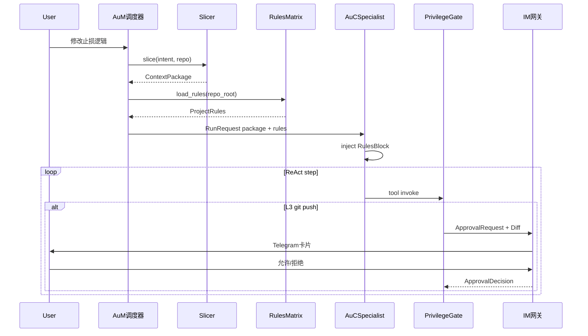
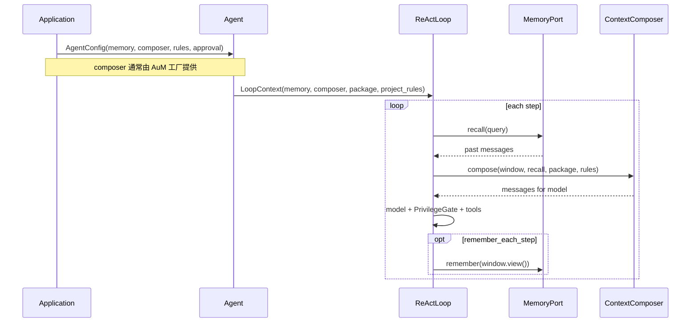

# AuC 与 AuM 集成

AuC 是**单智能体执行核心**；AuM（**Agents-ufy-Meta / Memory**）是调度与认知层：长期记忆、**Au-Context Slicer**、**Au-Rules Matrix**、**IM 二次授权**，以及未来的 `Au-Nuggets` 技能固化。本文说明边界、挂载方式与降级行为。

设计总览见 [design-philosophy.md](design-philosophy.md)。

## 责任划分

| 责任 | AuC | AuM |
|------|-----|-----|
| 单轮推理循环（AgentLoop） | 是 | 否 |
| Specialist 任务分派 | 否 | 是 |
| 工具注册与执行 | 是 | 可选：包装/审计 |
| 工具 L1/L2/L3 门控 | `ToolPrivilegeGate` | `.aurules` 策略 + L3 IM 批复 |
| 当前 Run 工作区（ContextWindow） | 是 | 否 |
| 跨 Run / 长期记忆 | 定义 `MemoryPort` | 实现 |
| 代码上下文切片 | `ContextPackage` 类型 | `SemanticSlicer` + grep/索引 |
| 项目军规 | `ProjectRulesPort` | 解析 `.aurules` / `AUM.md` |
| L3 人工审批 | `ApprovalPort` 类型 | Telegram 等 IM 网关 |
| 上下文组装 | 定义 `ContextComposer` | 默认实现（Rules+Package+Memory+Window） |
| 智能截断 / 摘要 | `TruncatePolicy` 接口 | 可提供实现 |
| Embedding、向量库 | 否 | 是 |
| 会话持久化（SessionStore） | 否 | 是 |
| Au-Nuggets 金块技能 | 否 | YAML 固化（Hermes 式进化） |

AuC **可不挂载 AuM** 运行（开发模式）；**生产 Specialist** 建议 AuM 分派时同时提供 Slicer、Rules，并配置 `ApprovalPort`。

## 端口协议

AuC 在 `auc/ports/memory.py`（实现阶段）中声明：

- **`MemoryPort`** — `recall` / `remember`
- **`ContextComposer`** — 合并 Rules、Package、recall 与 window
- **`ProjectRulesPort`** — 加载 `ProjectRules`
- **`ApprovalPort`** — L3 `request_approval` / `wait_decision`

完整签名见 [interfaces.md](interfaces.md)。

AuM 应：

1. 实现上述 Protocol（或提供子类供用户注入）。
2. 在自身文档中说明存储后端、索引与隐私策略。
3. 反向引用 AuC 版本，保证 `ChatMessage` 字段兼容。

## Specialist 分派全流程（推荐生产路径）



## 挂载流程（记忆 + 组装）



### 应用层伪代码（完整挂载）

```python
from aum import (
    AuMMemoryPort,
    DefaultComposer,
    SemanticSlicer,
    RulesMatrix,
    TelegramApprovalPort,
)
from auc import AgentConfig, DefaultAgent, ReActLoop
from auc.policy import DefaultToolPrivilegeGate

memory = AuMMemoryPort(session_id="user-123", store=...)
composer = DefaultComposer()
rules_port = RulesMatrix()
approval = TelegramApprovalPort(bot_token=...)
gate = DefaultToolPrivilegeGate(approval=approval)

# AuM 分派前切片 + 军规
package = await SemanticSlicer().slice(
    intent="修改量化策略止损逻辑", repo_root="/workspace/proj"
)
project_rules = await rules_port.load_rules("/workspace/proj")

config = AgentConfig(
    agent_id="specialist-quant",
    model=model_client,
    tools=registry,
    loop=ReActLoop(),
    memory=memory,
    composer=composer,
    rules=rules_port,
    approval=approval,
    privilege_gate=gate,
    slicer_policy=SlicerPolicy(require_package=True),
)

agent = DefaultAgent(config)
result = await agent.run(
    RunRequest(input="修改 stop_loss 阈值", context_package=package)
)
```

### 挂载检查清单

| 步骤 | 说明 |
|------|------|
| 1 | 项目根提供 `.aurules` 或 `AUM.md`（见 [aurules.md](aurules.md)） |
| 2 | AuM `SemanticSlicer` 生成分派用 `ContextPackage` |
| 3 | 创建 `MemoryPort`、`ContextComposer`、`ProjectRulesPort`、`ApprovalPort` |
| 4 | 配置 `ToolPrivilegeGate` 并注册工具 L1/L2/L3 |
| 5 | 传入 `AgentConfig`；`RunRequest.context_package` 携带切片 |
| 6 | 配置 IM 机器人接收 L3 卡片（见 [tool-privilege.md](tool-privilege.md)） |
| 7 | 订阅 `EventBus`（含 `approval_*` 事件）做审计 |

## recall 与 remember 调用点

| 时机 | 行为 | 配置 |
|------|------|------|
| 每步开始前 | `memory.recall(query)`，`query` 通常取 window 最后一条 user 内容 | 有 `memory` 即启用 |
| 每步结束后 | `memory.remember(items)` | `remember_each_step=True` |
| Run 结束后 | 应用层可显式 `remember` 最终 `messages` | 自定义 |

AuC 核心**不**规定 remember 的粒度（整窗 / 增量 / 仅 assistant）；由 AuM 或应用策略决定。

## ContextComposer 约定

推荐默认行为（AuM `DefaultComposer` 可参考）：

1. 若有 `system_prompt`，置于首位。
2. 插入 `recall` 消息（可标注 metadata 来源为 memory）。
3. 追加 `window.view()` 中当前 Run 消息。
4. 不对 recall 与 window 去重（去重策略由 AuM 可选实现）。

自定义 Composer 用于：RAG 片段转写、权限过滤、多租户隔离展示等。

## 无 AuM 降级

```python
config = AgentConfig(
    agent_id="standalone",
    model=model_client,
    tools=registry,
    memory=None,
    composer=None,
)
```

| 能力 | 行为 |
|------|------|
| 多轮对话 | 依赖调用方传入 `RunRequest.input` 为完整 `list[ChatMessage]`，或单 Run 内往返 |
| 跨 Run 记忆 | 不可用 |
| 上下文长度 | 仅 `ContextWindow.truncate` + `TruncatePolicy` |

## TruncatePolicy 与 AuM

AuC 的 `ContextWindow.truncate(policy)` 使用简单策略（如 `drop_oldest`）即可独立工作。AuM 可提供：

- 基于 token 计数的截断
- 调用模型摘要以压缩历史
- 将摘要写回 `MemoryPort` 再清空 window

此类逻辑通过 **自定义 ContextWindow 实现** 或 **在 Composer 内处理** 注入，无需改动 AuC Loop 契约。

## SessionStore（AuM 专有）

`SessionStore` **不在 AuC 定义**。AuM 用其管理：

- session 元数据（user_id、created_at）
- Run 历史索引
- 与 `MemoryPort` 的存储后端连接

AuC 仅接收 `run_id` / `agent_id` 作为可选关键字参数传入 `recall` / `remember`，便于 AuM 关联存储。

## 版本与兼容

- AuC 发布接口变更时，在 CHANGELOG 标注对 `MemoryPort` / `ContextComposer` 的影响。
- AuM 应针对 AuC 主版本做兼容测试（实现阶段建立联调示例仓库或集成测试）。

## Au-Nuggets（AuM 进化层，概要）

AuM 将多次 Specialist 试错中**验证成功**的路径剥离噪音，固化为 YAML 格式 **Au-Nuggets**，供后续分派注入（类比 Hermes 认知提炼）。AuC 仅通过 `MemoryPort.recall` 或专用 `SkillsPort`（未来）消费，不在本仓库实现。

## 相关文档

- [design-philosophy.md](design-philosophy.md)
- [context-slicer.md](context-slicer.md)
- [aurules.md](aurules.md)
- [tool-privilege.md](tool-privilege.md)
- [architecture.md](architecture.md)
- [interfaces.md](interfaces.md)
- [adr/002-memory-boundary.md](adr/002-memory-boundary.md)
- [adr/003-context-slicer.md](adr/003-context-slicer.md)
- [adr/004-project-rules.md](adr/004-project-rules.md)
- [adr/005-tool-privilege-2fa.md](adr/005-tool-privilege-2fa.md)
