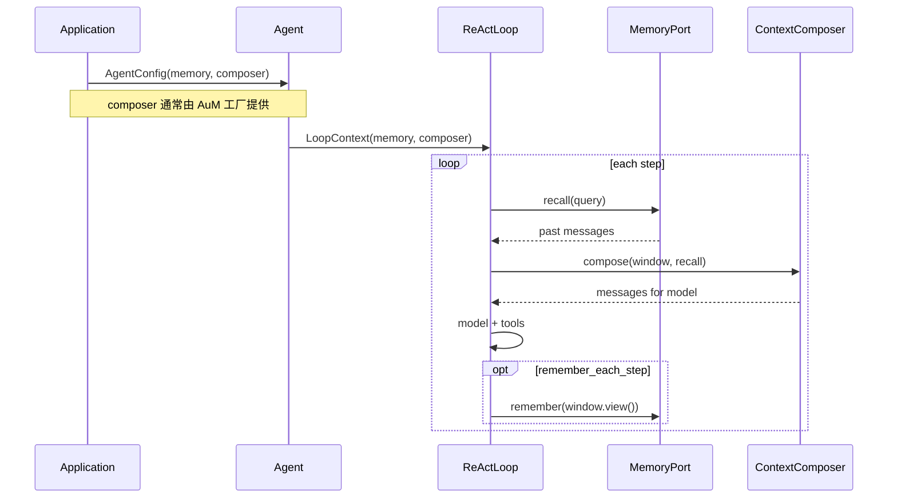

# AuC 与 AuM 集成

AuC 是**单智能体核心**；AuM（Agents-ufy-Memory，规划中）在 AuC 定义的端口上提供**长期记忆、检索与会话持久化**。本文说明边界、挂载方式与无 AuM 时的降级行为。

## 责任划分

| 责任 | AuC | AuM |
|------|-----|-----|
| 单轮推理循环（AgentLoop） | 是 | 否 |
| 工具注册与执行 | 是 | 可选：包装/审计工具 |
| 当前 Run 工作区（ContextWindow） | 是 | 否 |
| 跨 Run / 长期记忆 | 定义 `MemoryPort` | 实现 |
| 上下文组装策略 | 定义 `ContextComposer` | 默认或定制实现 |
| 智能截断 / 摘要 | `TruncatePolicy` 接口 | 可提供实现 |
| Embedding、向量库、chunking | 否 | 是 |
| 会话持久化（SessionStore） | 否 | 是（AuM 专有类型） |

AuC **不**依赖 AuM 即可运行：未配置 `memory` 时，Agent 仅使用 `ContextWindow` 内的消息。

## 端口协议

AuC 在 `auc/ports/memory.py`（实现阶段）中声明：

- **`MemoryPort`** — `recall` / `remember`
- **`ContextComposer`** — 合并 recall 与 window

完整签名见 [interfaces.md](interfaces.md)。

AuM 应：

1. 实现上述 Protocol（或提供子类供用户注入）。
2. 在自身文档中说明存储后端、索引与隐私策略。
3. 反向引用 AuC 版本，保证 `ChatMessage` 字段兼容。

## 挂载流程



### 应用层伪代码

```python
from aum import AuMMemoryPort, DefaultComposer  # AuM 包，未来实现
from auc import AgentConfig, DefaultAgent, ReActLoop
from auc.tools import ToolRegistry

memory = AuMMemoryPort(session_id="user-123", store=...)
composer = DefaultComposer(max_recall=10, insert_recall_after_system=True)

config = AgentConfig(
    agent_id="assistant",
    model=model_client,
    tools=registry,
    loop=ReActLoop(),
    memory=memory,
    composer=composer,
    loop_config=LoopConfig(remember_each_step=True),
)

agent = DefaultAgent(config)
result = await agent.run(RunRequest(input="继续上次的话题"))
```

### 挂载检查清单

| 步骤 | 说明 |
|------|------|
| 1 | 创建 AuM `MemoryPort`，绑定 user/session/agent 作用域 |
| 2 | 创建 `ContextComposer`（或使用 AuM 默认） |
| 3 | 传入 `AgentConfig(memory=..., composer=...)` |
| 4 | 按需设置 `LoopConfig.remember_each_step` 或在 Run 结束时单次 `remember` |
| 5 | 订阅 `EventBus` 做审计（可选） |

## recall 与 remember 调用点

| 时机 | 行为 | 配置 |
|------|------|------|
| 每步开始前 | `memory.recall(query)`，`query` 通常取 window 最后一条 user 内容 | 有 `memory` 即启用 |
| 每步结束后 | `memory.remember(items)` | `remember_each_step=True` |
| Run 结束后 | 应用层可显式 `remember` 最终 `messages` | 自定义 |

AuC 核心**不**规定 remember 的粒度（整窗 / 增量 / 仅 assistant）；由 AuM 或应用策略决定。

## ContextComposer 约定

推荐默认行为（AuM `DefaultComposer` 可参考）：

1. 若有 `system_prompt`，置于首位。
2. 插入 `recall` 消息（可标注 metadata 来源为 memory）。
3. 追加 `window.view()` 中当前 Run 消息。
4. 不对 recall 与 window 去重（去重策略由 AuM 可选实现）。

自定义 Composer 用于：RAG 片段转写、权限过滤、多租户隔离展示等。

## 无 AuM 降级

```python
config = AgentConfig(
    agent_id="standalone",
    model=model_client,
    tools=registry,
    memory=None,
    composer=None,
)
```

| 能力 | 行为 |
|------|------|
| 多轮对话 | 依赖调用方传入 `RunRequest.input` 为完整 `list[ChatMessage]`，或单 Run 内往返 |
| 跨 Run 记忆 | 不可用 |
| 上下文长度 | 仅 `ContextWindow.truncate` + `TruncatePolicy` |

## TruncatePolicy 与 AuM

AuC 的 `ContextWindow.truncate(policy)` 使用简单策略（如 `drop_oldest`）即可独立工作。AuM 可提供：

- 基于 token 计数的截断
- 调用模型摘要以压缩历史
- 将摘要写回 `MemoryPort` 再清空 window

此类逻辑通过 **自定义 ContextWindow 实现** 或 **在 Composer 内处理** 注入，无需改动 AuC Loop 契约。

## SessionStore（AuM 专有）

`SessionStore` **不在 AuC 定义**。AuM 用其管理：

- session 元数据（user_id、created_at）
- Run 历史索引
- 与 `MemoryPort` 的存储后端连接

AuC 仅接收 `run_id` / `agent_id` 作为可选关键字参数传入 `recall` / `remember`，便于 AuM 关联存储。

## 版本与兼容

- AuC 发布接口变更时，在 CHANGELOG 标注对 `MemoryPort` / `ContextComposer` 的影响。
- AuM 应针对 AuC 主版本做兼容测试（实现阶段建立联调示例仓库或集成测试）。

## 相关文档

- [architecture.md](architecture.md)
- [interfaces.md](interfaces.md)
- [adr/002-memory-boundary.md](adr/002-memory-boundary.md)
