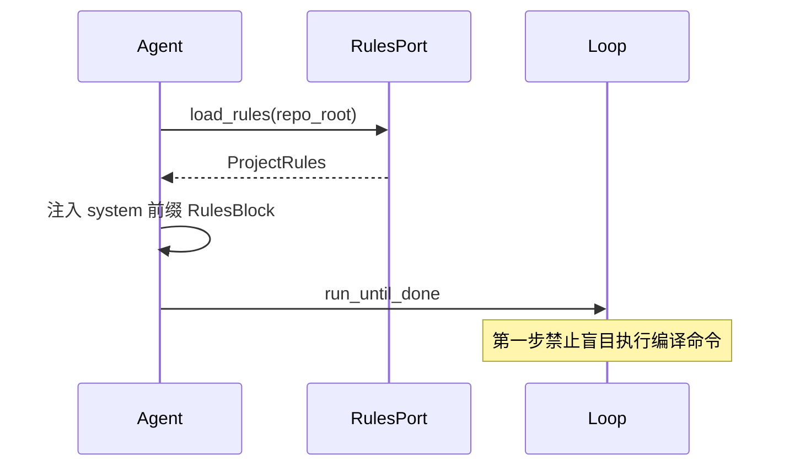

# Au-Rules Matrix（项目军规）

借鉴 Claude Code 进入仓库先读 `CLAUDE.md` 的习惯，ufy 用 **`.aurules`** 与 **`AUM.md`** 固化项目的「法律法规」：编译、测试、风格、密钥红线。AuM **解析并缓存**军规矩阵；AuC Specialist **Run 前强制注入**上下文。

## 文件约定

| 文件 | 优先级 | 说明 |
|------|--------|------|
| `.aurules` | 高 | 机器可读片段（YAML front matter + Markdown） |
| `AUM.md` | 中 | 人类可读项目手册，可含长说明 |
| `CLAUDE.md` | 低（兼容） | 若存在且无 `.aurules`，AuM 可降级导入 |

建议仓库根目录至少提供其一。示例见 [examples/aurules.sample.md](examples/aurules.sample.md)。

## 示例 `.aurules`

```markdown
---
version: 1
project: quant-agent
---

## Build Commands
- Development: `npm run dev`
- Production Build: `docker build -t quant-agent:v1 .`

## Test Commands
- Critical Path: `pytest tests/test_risk_manager.py`

## Code Style
- Strict type hinting required for all Python code.
- Never hardcode OKX/Binance API keys; use environment variables.

## Sandbox
- All Specialist writes must stay under `/workspace` (L2).
```

## Au-Rules Matrix（AuM）

AuM 在**记忆矩阵（Memory Matrix）**中维护：

| 维度 | 内容 |
|------|------|
| **RulesIndex** | 项目根 → 解析后的 `ProjectRules` 结构 |
| **Invalidation** | 文件 mtime / git revision 变更时重载 |
| **Inheritance** | monorepo 子目录可叠加子级 `.aurules` |

AuC 不解析 Markdown；通过 **`ProjectRulesPort`** 获取已结构化的 `ProjectRules`（见 [interfaces.md](interfaces.md)）。

## Run 前置强制加载（AuC）



### RulesBlock 注入格式（推荐）

```text
[AU-RULES v1]
Build: npm run dev | docker build -t quant-agent:v1 .
Test: pytest tests/test_risk_manager.py
Style: strict type hints; no hardcoded exchange API keys.
[/AU-RULES]
```

`ContextComposer` 将 RulesBlock 固定在 **system 最前**（仅次于安全策略），优先级高于 Slicer 代码片段。

## 与 Tool Privilege 联动

`.aurules` 可声明：

```yaml
tool_policy:
  git_push: L3
  live_trading_api: L3
  docker_build: L2
```

AuC `ToolRegistry` 注册时读取合并策略，见 [tool-privilege.md](tool-privilege.md)。

## Specialist 行为约束

| 场景 | 期望行为 |
|------|----------|
| 首次编译 | 从 Rules 读取 `Build Commands`，不猜测 |
| 跑测试 | 使用 `Critical Path` 声明的 pytest 路径 |
| 改 API 密钥 | Rules 禁止 → 模型应拒绝并提示 env var |

违反军规的 tool 调用可由 AuM 审计日志标记，供 `Au-Nuggets` 进化时降权。

## 相关文档

- [design-philosophy.md](design-philosophy.md)
- [interfaces.md](interfaces.md) — `ProjectRulesPort`
- [aum-integration.md](aum-integration.md)
- [adr/004-project-rules.md](adr/004-project-rules.md)
