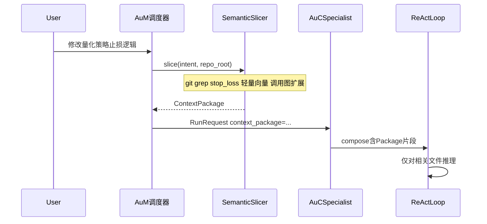

# Au-Context Slicer（动态项目裁剪）

借鉴 Claude Code 的「只喂相关几 KB 代码」策略，ufy 在 **AuM（Meta）** 侧实现 **Au-Context Slicer**，向 **AuC Specialist** 交付压缩后的 **ContextPackage**，而非整仓文件树。

## 问题与目标

| 痛点 | Slicer 目标 |
|------|-------------|
| 整库塞进上下文，API 费用爆炸 | Token 预算可控 |
| 无关代码干扰推理 | 降低幻觉（Hallucination） |
| Specialist 自己 `list_dir` 乱逛 | 分派前由 AuM 过滤 |

## 责任边界

| 组件 | 仓库 | 职责 |
|------|------|------|
| **SemanticSlicer** | AuM | 根据任务意图检索、切片、打包 |
| **ContextPackage** | AuC 类型定义 | 挂载到 `RunRequest` / `LoopContext` 的不可变包 |
| **ContextComposer** | AuM 实现 | 将 Package + window + rules 合并为模型输入 |
| **裸读禁止** | AuC 策略 | 未持 Package 时，L1 工具可拒绝 `read_tree` 全仓 |

AuC **不实现**向量索引与 `git grep`；可提供 `auc.tools.repo.GrepTool` 供 **Slicer 在 AuM 进程** 调用， Specialist 默认不直接持有无界读权限。

## 工作流



### 切片管线（AuM 实现参考）

1. **意图解析** — 从用户消息提取符号、路径、业务关键词（如 `stop_loss`）。
2. **快速检索** — `git grep` / `rg` / 轻量向量索引（AuM 配置）。
3. **调用图扩展** — 可选：上下游 1-hop 函数、同文件 imports。
4. **预算裁剪** — `max_tokens` / `max_files` 硬顶，超出则摘要或丢弃低分片段。
5. **打包** — 生成 `ContextPackage`（见 [interfaces.md](interfaces.md)）。

## ContextPackage 结构（AuC 定义）

```python
@dataclass
class CodeSnippet:
    path: str
    content: str
    line_range: tuple[int, int] | None = None
    relevance_score: float | None = None

@dataclass
class ContextPackage:
    package_id: str
    intent_summary: str
    snippets: list[CodeSnippet]
    token_estimate: int
    provenance: dict[str, Any]  # grep 查询、索引版本等
```

Specialist 的 `RunRequest.metadata["context_package_id"]` 或显式字段携带；`ContextComposer.compose` **必须**将 snippets 置于 system 或独立 `role=system` 块（标注 `source=slicer`），避免与 user 消息混淆。

## 与 MemoryPort 的区别

| | MemoryPort | Context Slicer |
|--|------------|----------------|
| 内容 | 跨 Run 对话/事实 | 当前任务相关**代码** |
| 时机 | recall / remember | **Run 开始前**一次性 |
| 实现 | AuM 存储后端 | AuM 检索管线 |

二者可同时挂载：Slicer 供代码上下文，Memory 供历史决策与用户偏好。

## Specialist 约束（AuC 执行策略）

```python
@dataclass
class SlicerPolicy:
    require_package: bool = True       # 生产环境建议 True
    max_ad_hoc_read_bytes: int = 8192  # 允许补充读取的上限
    allow_full_repo_grep: bool = False # Specialist 工具层
```

- `require_package=True`：无 Package 时 Run 拒绝启动或 AuM 自动触发切片。
- 允许 **补充读取**：单文件 `read_file` 计入 `max_ad_hoc_read_bytes`，防止变相整仓读取。

## 示例：用户意图 → 包内容

用户：「修改量化策略的止损逻辑」

Slicer 产出（示意）：

| 文件 | 片段 |
|------|------|
| `strategy/risk.py` | `def stop_loss(...)` 及调用方 |
| `tests/test_risk_manager.py` | 相关断言 |

**不**包含：无关前端、部署脚本、历史日志。

## 相关文档

- [interfaces.md](interfaces.md) — `ContextPackage` 字段
- [aum-integration.md](aum-integration.md) — AuM 分派时挂载
- [adr/003-context-slicer.md](adr/003-context-slicer.md)
