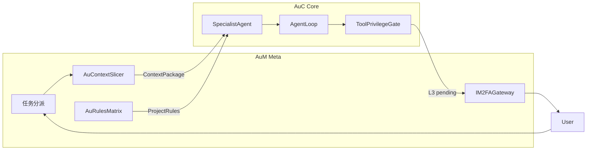
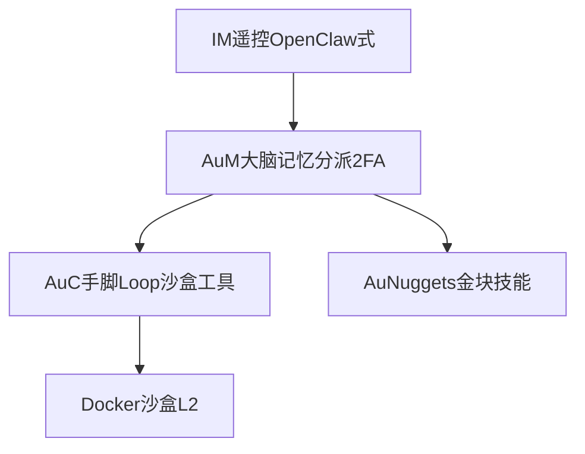

# 设计哲学：Claude Code 经验与 ufy 闭环

AuC + AuM 的目标不是「聊天界面更华丽」，而是把大模型潜能压在**可工程化推演**的轨道上：极致上下文控制、项目军规前置、高危操作人类终审。本文吸收 **Claude Code (Anthropic)** 的公认优势，映射为 ufy 体系的三项机制与一项生态蓝图。

## 为何借鉴 Claude Code

| 特质 | 含义 | ufy 落点 |
|------|------|----------|
| **Context Control** | 不把整仓源码塞进模型；只喂与任务相关的几 KB | [context-slicer.md](context-slicer.md) — Au-Context Slicer |
| **Architectural Deduction** | 动手前先懂项目怎么编、怎么测、什么不能碰 | [aurules.md](aurules.md) — Au-Rules Matrix |
| **Human-in-the-loop** | 高危操作停住，等人确认再继续 | [tool-privilege.md](tool-privilege.md) — L3 二次授权 |

AuC 负责**执行面**（Loop、工具、权限拦截）；AuM 负责**调度与认知面**（切片、军规矩阵、IM 网关、金块技能）。边界见各专题文档。

## 三项核心机制

### 1. Au-Context Slicer（动态项目裁剪）

- **问题**：整库上下文 → Token 灾难 + 幻觉。
- **原则**：Specialist **禁止裸读仓库根目录**；AuM 分派前完成语义切片，交付 `ContextPackage`。
- **详情**：[context-slicer.md](context-slicer.md)

### 2. Au-Rules Matrix（项目军规）

- **问题**：Agent 盲目猜 `npm test` / `pytest` 命令 → 试错成本极高。
- **原则**：Run 开始前**强制**加载 `.aurules` / `AUM.md`（类比 `CLAUDE.md`）。
- **详情**：[aurules.md](aurules.md)

### 3. Tool Privilege + L3 二次授权（半自主状态机）

- **问题**：后台自动化 `git push`、实盘 API、越权写宿主机不可接受。
- **原则**：AuC 工具分级；L3 挂起 Session，AuM 经 IM 推送 Diff 卡片等人批复。
- **详情**：[tool-privilege.md](tool-privilege.md)

## 生态蓝图（AuM + AuC + 外部经验）

| 层次 | 借鉴来源 | ufy 能力 |
|------|----------|----------|
| 多端常驻与遥控 | OpenClaw 类经验 | AuM：Telegram / IM 网关、Specialist 动态注册 |
| 沙盒与技能固化 | Hermes 类经验 | AuC：容器内 L2 执行；AuM：`Au-Nuggets` YAML 金块 |
| 克制与严谨 | **Claude Code** | Slicer + Rules + L3-2FA |

**工业级理性**：沙盒隔离、上下文严谨、人类最终审批。  
**极客向能力**：7×24 后台、多端遥控、路径固化自我进化。

## 与现有 AuC 文档的关系

| 文档 | 更新内容 |
|------|----------|
| [architecture.md](architecture.md) | 设计原则扩展、包结构新增 `policy/` |
| [interfaces.md](interfaces.md) | `ContextPackage`、`ProjectRulesPort`、`ToolPrivilege` |
| [aum-integration.md](aum-integration.md) | Slicer、Rules Matrix、2FA 网关协作 |
| [loops.md](loops.md) | `HumanInTheLoopLoop`、挂起/恢复 |

## ADR 索引

- [adr/003-context-slicer.md](adr/003-context-slicer.md)
- [adr/004-project-rules.md](adr/004-project-rules.md)
- [adr/005-tool-privilege-2fa.md](adr/005-tool-privilege-2fa.md)
