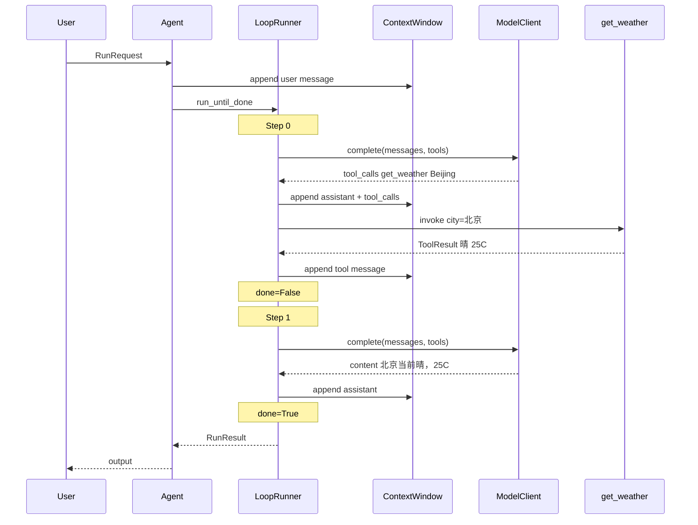

# 最小 ReAct 运行示例

本文用伪代码描述一次无 AuM、单工具的 `agent.run()` 时序，对应默认 `ReActLoop`。不可直接运行。

## 场景

- 用户问：「北京现在天气如何？」
- 注册工具：`get_weather(city: str)`
- 模型第一轮返回 `tool_calls`；第二轮返回自然语言答案。

## 组装 Agent

```python
registry = ToolRegistry()
registry.register(GetWeatherTool())

config = AgentConfig(
    agent_id="demo",
    model=OpenAICompatibleClient(...),
    tools=registry,
    loop=None,  # 工厂默认 ReActLoop
    memory=None,
    composer=None,
    system_prompt="你是一个有帮助的助手。",
)

agent = DefaultAgent(config)
```

## 执行

```python
result = await agent.run(RunRequest(input="北京现在天气如何？"))
print(result.output)
print(result.status)  # "completed"
```

## 时序（两步 ReAct）



## 消息窗演变

| 步骤后 | window 中的角色序列 |
|--------|---------------------|
| 初始化 | `user` |
| Step 0 后 | `user` → `assistant`(含 tool_calls) → `tool` |
| Step 1 后 | … → `assistant`(最终答案) |

## 事件流（run_stream 视角）

若调用 `async for event in agent.run_stream(request)`，典型顺序：

1. `run_start`
2. `step_start` (index=0)
3. `model_delta` / 工具相关 `tool_start` → `tool_end`
4. `step_end`
5. `step_start` (index=1)
6. `model_delta`
7. `step_end`
8. `run_end` (status=completed)

## 相关文档

- [loops.md](../loops.md)
- [interfaces.md](../interfaces.md)
