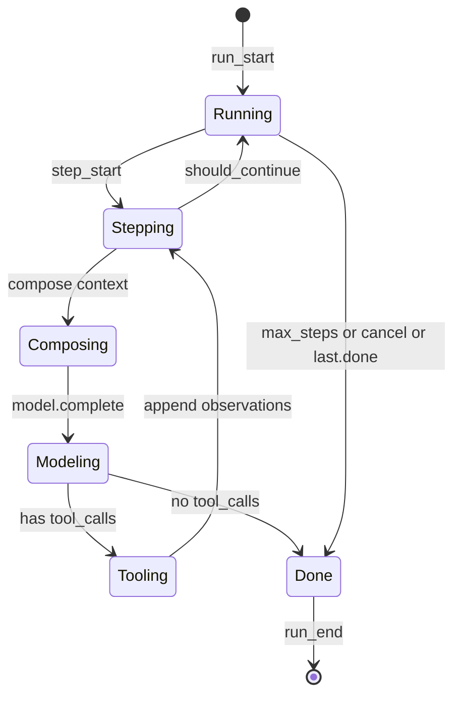
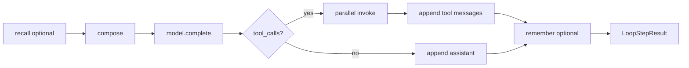

# 可插拔 AgentLoop

AuC 将「单智能体如何一步步推理与行动」抽象为 **AgentLoop**。`AgentLoopRunner` 负责重复调用 `step` 与 `should_continue`，直到满足终止条件。默认实现为 **ReActLoop**（Reason + Act）。

## 契约总览



| 方法 | 责任 |
|------|------|
| `step(ctx)` | 执行**一步**推理—行动，更新 `ContextWindow`，返回 `LoopStepResult` |
| `should_continue(ctx, last)` | 是否进入下一步 |
| `run_until_done`（Runner） | 循环 `step`，处理 `cancelled` 与 `max_steps`，组装 `RunResult` |

接口定义见 [interfaces.md](interfaces.md)。

## AgentLoopRunner 伪代码

```python
async def run_until_done(loop: AgentLoop, ctx: LoopContext) -> RunResult:
    ctx.events.emit(RunEvent(type="run_start", ...))
    step_index = 0
    last: LoopStepResult | None = None

    while True:
        if ctx.cancelled:
            return _result(ctx, status="cancelled", last=last)

        ctx.events.emit(RunEvent(type="step_start", payload={"index": step_index}))
        last = await loop.step(ctx)
        step_index += 1
        ctx.events.emit(RunEvent(type="step_end", payload={"index": step_index - 1, "done": last.done}))

        if not loop.should_continue(ctx, last):
            break

    status = _resolve_status(ctx, last)
    ctx.events.emit(RunEvent(type="run_end", payload={"status": status}))
    return _result(ctx, status=status, last=last)
```

`_resolve_status`：`last.done` 且非 cancel → `completed`；步数用尽 → `max_steps`；含 error 标记 → `error`。

## ReActLoop（默认实现）

ReAct 循环每一步遵循：**组合上下文 → 调用模型 → 若有工具调用则并行执行 → 写回观察结果**。

### 单步流程



### ReActLoop.step 伪代码

```python
class ReActLoop:
    async def step(self, ctx: LoopContext) -> LoopStepResult:
        recall: list[ChatMessage] = []
        if ctx.memory is not None:
            query = _last_user_content(ctx.window)
            recall = await ctx.memory.recall(
                query, limit=10, run_id=ctx.run_id, agent_id=ctx.agent_id
            )

        if ctx.composer is not None:
            messages = await ctx.composer.compose(
                ctx.window, recall, system_prompt=ctx.system_prompt
            )
        else:
            messages = _default_compose(ctx.window, recall, ctx.system_prompt)

        schemas = ctx.tools.list_schemas()
        assistant = await ctx.model.complete(messages, tools=schemas or None)

        ctx.events.emit(RunEvent(type="model_delta", payload={"content": assistant.content}))

        tool_results: list[ToolResult] = []
        if assistant.tool_calls:
            ctx.window.append(_assistant_with_tools(assistant))
            if ctx.config.parallel_tool_calls:
                tool_results = await _invoke_all(ctx, assistant.tool_calls)
            else:
                tool_results = await _invoke_sequential(ctx, assistant.tool_calls)
            for tr in tool_results:
                ctx.window.append(_tool_message(tr))
        elif assistant.content:
            ctx.window.append(ChatMessage(role="assistant", content=assistant.content))

        if ctx.memory and ctx.config.remember_each_step:
            await ctx.memory.remember(
                ctx.window.view(), run_id=ctx.run_id, agent_id=ctx.agent_id
            )

        done = not assistant.tool_calls and bool(assistant.content)
        return LoopStepResult(
            assistant_message=assistant,
            tool_results=tool_results,
            step_index=...,
            done=done,
        )

    def should_continue(self, ctx: LoopContext, last: LoopStepResult) -> bool:
        if ctx.cancelled:
            return False
        if last.done:
            return False
        if last.step_index >= ctx.config.max_steps:
            return False
        return True
```

### 设计说明

|  topic | 说明 |
|--------|------|
| **并行工具** | `LoopConfig.parallel_tool_calls=True` 时用 `asyncio.gather`；失败单条 `ToolResult.is_error=True`，不中断其余工具 |
| **无 composer** | `_default_compose`：`system` + `recall` + `window.view()` 顺序拼接 |
| **仅 tool_calls 无 content** | `done=False`，继续下一步直至模型给出文本或达到 `max_steps` |
| **流式** | `run_stream` 在 `complete_stream` 路径下逐 chunk 发 `model_delta`（实现阶段与 `step` 对齐） |

完整端到端示例见 [examples/minimal-react.md](examples/minimal-react.md)。

## ToolPrivilegeGate 与 Loop 协作

ReActLoop 在工具执行前**必须**经 `ToolPrivilegeGate`（不可在 Loop 内绕过）：

```python
# 伪代码：工具执行路径
policy = ctx.tools.get_policy(tool_name)
outcome = await ctx.privilege_gate.check_and_invoke(tool, policy, args, ctx=ctx)
if isinstance(outcome, PendingApproval):
    decision = await ctx.approval.wait_decision(outcome.request_id)
    if not decision.approved:
        ctx.cancelled = True
        return LoopStepResult(..., done=True)
    outcome = await gate.resume_invoke(...)
```

详见 [tool-privilege.md](tool-privilege.md)。

## HumanInTheLoopLoop（可选）

在标准 ReAct 之上，对**预计为 L3** 的 tool 在调用前额外 `emit(approval_required)`，改善 IM/CLI 体验。生产环境仍以 **Gate 强制拦截** 为准，Loop 仅作提示层。

```python
class HumanInTheLoopLoop(ReActLoop):
    async def step(self, ctx: LoopContext) -> LoopStepResult:
        # 可在 model 返回 tool_calls 后、gate 之前预发事件
        return await super().step(ctx)
```

## 自定义 Loop

实现 `AgentLoop` 即可替换默认 ReAct，无需修改 `Agent` 门面。

### 适用场景

| Loop 类型 | 场景 |
|-----------|------|
| **PlanExecuteLoop** | 先让模型输出结构化计划，再按步骤执行工具 |
| **ReflectionLoop** | 每步后增加自我批评子调用 |
| **HumanInTheLoopLoop** | 工具调用前通过 EventBus 等待外部批准 |

### 最小自定义模板

```python
class MyLoop:
    async def step(self, ctx: LoopContext) -> LoopStepResult:
        # 1. 自行决定 messages 构建方式
        # 2. 调用 ctx.model / ctx.tools
        # 3. 更新 ctx.window
        # 4. 设置 done 与 tool_results
        ...

    def should_continue(self, ctx: LoopContext, last: LoopStepResult) -> bool:
        return not ctx.cancelled and not last.done and last.step_index < ctx.config.max_steps
```

### 注册到 Agent

```python
config = AgentConfig(
    agent_id="demo",
    model=my_model,
    tools=registry,
    loop=MyLoop(),  # 替换默认 ReActLoop
)
agent = DefaultAgent(config)
```

### 与 ReAct 的共存

- `AgentConfig.loop is None` → 工厂使用 `ReActLoop()`。
- 多种 Loop 可并存于不同 Agent 实例，**单 Agent 单 Loop**（不在 AuC 核心做 Loop 链式组合；链式属于编排层未来能力）。

## LoopConfig 参考

| 字段 | 默认 | 说明 |
|------|------|------|
| `max_steps` | `20` | 最大 `step` 次数 |
| `stop_sequences` | `[]` | 传给 ModelClient（若适配器支持） |
| `parallel_tool_calls` | `True` | 多工具并发 |
| `remember_each_step` | `False` | 每步 `memory.remember` |

## 相关文档

- [tool-privilege.md](tool-privilege.md) — L3 挂起与恢复
- [context-slicer.md](context-slicer.md) — `LoopContext.context_package`
- [interfaces.md](interfaces.md) — `LoopContext`、`LoopStepResult`
- [architecture.md](architecture.md) — Run 级数据流
- [aum-integration.md](aum-integration.md) — recall / remember 挂载点
