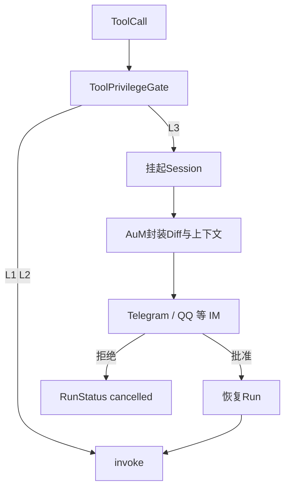

# 工具权限分级与 L3 二次授权

借鉴 Claude Code 对 `git push`、高额 API、系统级改动的**终端确认**，AuC 在框架层实现 **Tool Privilege Levels** 与 **挂起—审批—恢复** 状态机；经 **IM 网关（Telegram / QQ）** 完成人机二次授权（2FA for AI）。

## 权限分级

| 级别 | 名称 | 典型操作 | 默认策略 |
|------|------|----------|----------|
| **L1** | Read-Only | 读文件、查状态、`git status` | **自动放行** |
| **L2** | Write-Isolated | 沙盒内写代码、编译、单元测试 | **自动放行**（需沙盒路径策略） |
| **L3** | High-Risk / Host Impact | `git push`、实盘资金 API、突破沙盒写宿主机 | **挂起 + 人工批准** |

```python
ToolPrivilege = Literal["L1", "L2", "L3"]

@dataclass
class ToolPolicy:
    name: str
    privilege: ToolPrivilege
    sandbox_only: bool = False  # L2 常为 True
```

工具注册时声明；`.aurules` 可覆盖（见 [aurules.md](aurules.md)）。

## AuC：ToolPrivilegeGate

在 `ToolRegistry.invoke` 与 Loop 之间插入门控：



### 挂起语义

| 状态 | 说明 |
|------|------|
| `RunStatus.pending_approval` | 新增状态：等待 L3 批复 |
| `ApprovalRequest` | 含 `run_id`、`tool_call`、`diff`、`risk_summary` |
| `ApprovalDecision` | `approved` / `denied` / `timeout` |

Loop **不**丢弃 `LoopContext`；将当前 step 冻结在内存或 AuM `SessionStore` 快照，直至 `ApprovalPort.resolve(request_id)` 返回。

## AuM：IM 2FA 网关

AuC 定义 **`ApprovalPort`**（AuM 实现）：

```python
class ApprovalPort(Protocol):
    async def request_approval(self, req: ApprovalRequest) -> str: ...  # request_id
    async def wait_decision(
        self, request_id: str, timeout: float = 3600
    ) -> ApprovalDecision: ...
```

AuM 职责：

1. 从挂起的 Run 提取 **代码 Diff**、分支名、工具参数。
2. 格式化为 IM 卡片（Telegram Inline Keyboard 或 QQ 消息按钮：`允许并继续` / `拒绝并中断`；共用 `format_approval_card`）。
3. 将用户点击结果回写 `ApprovalPort`。

### IM 卡片示意

```text
⚠️ AuM 风险提示
Agent 正在尝试向 main 分支推送代码。
─── 代码 Diff ───
+ def stop_loss():
...
[ 允许并继续 ]  [ 拒绝并中断 ]
```

用户睡觉期间：L1/L2 后台自动化可继续；**L3 永远无法自作主张**。

## 事件扩展

新增 `RunEvent` 类型（见 [interfaces.md](interfaces.md)）：

- `approval_required`
- `approval_granted`
- `approval_denied`

便于 CLI / IM 与 `run_stream` 订阅同一套可观测性。

## HumanInTheLoopLoop

可在 [loops.md](loops.md) 使用专用 Loop：在每次 L3 调用前主动 `request_approval`，与 Gate 双保险。

生产推荐：**Gate 强制拦截**（不可被 Loop 绕过）；Loop 仅作显式提示。

## 沙盒与 L2

L2 工具必须满足：

- 写路径 ⊆ `.aurules` 声明的 `sandbox_root`（如 `/workspace`）
- 禁止挂载宿主机 `/etc`、`~/.ssh`

越界尝试升级为 **L3** 或硬拒绝。

## IM 实现（Telegram / QQ）

| 端口 | 基类 | 回调语义 | 安装 |
|------|------|----------|------|
| `TelegramApprovalPort` | `HttpImApprovalPort` | `auc:approve\|deny:<id>`，Bot API 轮询 | `pip install -e '.[telegram]'` |
| `QQApprovalPort` | `HttpImApprovalPort` | 同上，OneBot Webhook 写入 | `pip install -e '.[qq]'` |

详见 [详细设计.md](详细设计.md) §12、[需求.md](需求.md) R24。

## 会话授权模式（R6，已实现）

在静态 L1/L2/L3 之上，会话级 **授权模式** 决定「哪些操作需要人工确认」。用户可见四档（详见 [approval-modes.md](approval-modes.md)）：

| 用户模式 | 配置值 `autonomy` | 行为摘要 |
|----------|-------------------|----------|
| 每次都询问 | `confirm-all` | L2 写文件 + L2 改状态 + L3 均挂起审批 |
| 改状态时询问（**默认**） | `auto-edit` | L2 写文件自动；改状态 + L3 挂起 |
| 危险时询问 | `full-auto` | 仅 L3 与 Escalation 升级挂起 |
| 全部通过（规划） | `auto-approve` + 门禁 | 含 L3 自动批准，仅沙盒开发环境 |

实现：`auc/policy/autonomy.py` → `AutonomyPolicy.requires_approval()`。  
**硬规则**：`ask-on-danger` / `full-auto` 下 L3 仍默认挂起；Escalation 锁定规则（`sudo`、`pipe-sh`、`dot-auc`）任何模式不可关。

`confirm-all` 下 `write_file` 挂起并携带 unified diff，与 R9 Diff 审阅共用 `ApprovalPort`。

### 配置入口

```bash
auc chat --autonomy auto-edit          # CLI 启动参数
/autonomy confirm-all                  # REPL 斜杠命令
```

Web：`POST /api/chat/stream` 的 `autonomy` 字段；设置页授权模式选择器（规划 M3）。

完整裁决链（Hooks → Escalation → Autonomy → Gate → Checkpoint → invoke）见 [adr/006-tool-decision-chain.md](adr/006-tool-decision-chain.md)。

## 内置工具默认分级（摘要）

| 工具 | 级别 | 备注 |
|------|------|------|
| `read_file`、`grep_search`、`list_dir` | L1 | 只读 |
| `write_file`、`delete_path`、`run_command` | L2 | 写文件 / 改状态 |
| `fetch_url`、`git_push` | L3 | 外链 / 远端推送 |
| `git_commit` 等 | L2 | `mutates_state` |

权限下限见 `auc/tools/privilege_floor.py`；项目 `.aurules` 只能升权。

## 相关文档

- [approval-modes.md](approval-modes.md) — **授权模式**（每次都询问 / 危险时询问 / 全部通过）
- [interfaces.md](interfaces.md) — `ApprovalPort`、`ToolPolicy`
- [aum-integration.md](aum-integration.md) — IM 网关
- [adr/005-tool-privilege-2fa.md](adr/005-tool-privilege-2fa.md)
- [adr/006-tool-decision-chain.md](adr/006-tool-decision-chain.md) — 裁决链（R1/R6/R9/R14）
